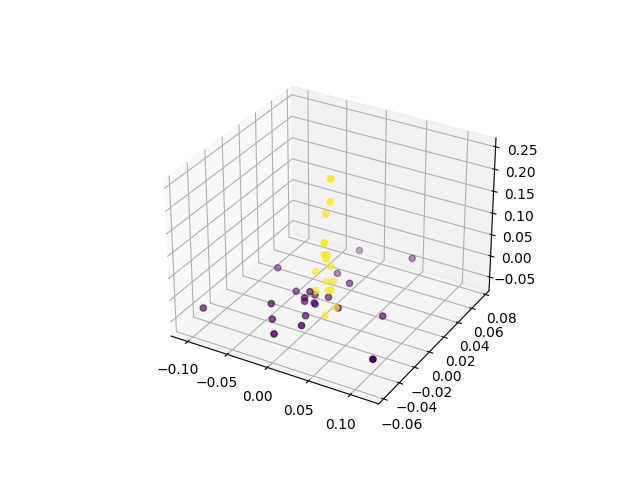
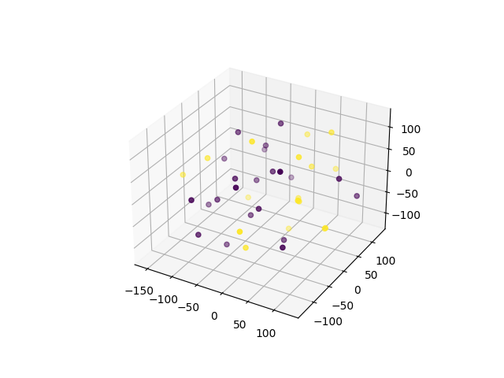
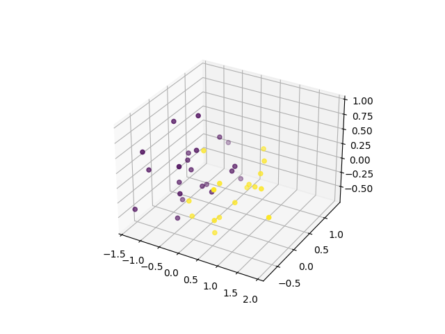
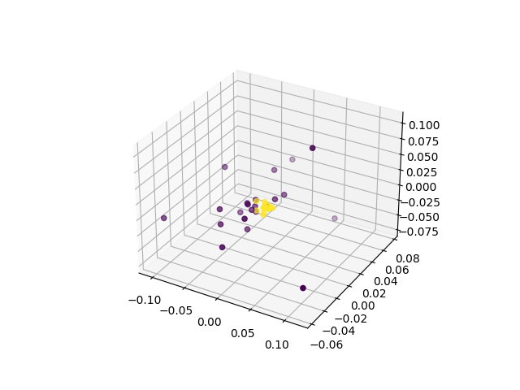
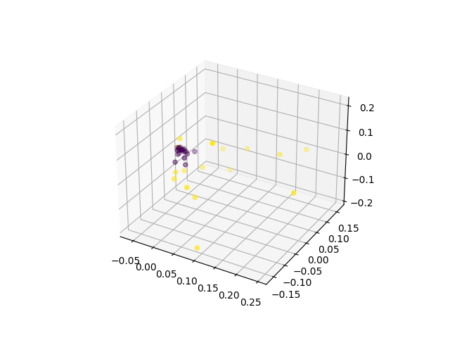

# 双相障碍检测

3210104591 	秦雨扬

## 实验背景

双相障碍属于心境障碍的一种疾病，英文名称为 Bipolar Disorder（BD），别名为 Bipolar Affective Disorder，表示既有躁狂发作又有抑郁发作的一类疾病。

目前病因未明，主要是生物、心理与社会环境诸多方面因素参与其发病过程。

当前研究发现，在双相障碍发生过程中遗传因素、环境或应激因素之间的交互作用、以及交互作用的出现时间点等都产生重要的影响；临床表现按照发作特点可以分为抑郁发作、躁狂发作或混合发作。

双相障碍检测，即通过医学检测数据预测病人是否双相障碍，或双相障碍治疗是否有效。

医学数据包括医学影像数据与肠道数据。

由于缺少医学样本且特征过多，因此选取合适的特征对双模态特征进行整合并训练合适的分类器进行模型预测具有较强的现实需求与医学意义。

本实验需要大家完成少样本、多特征下的监督学习。

## 实验要求

a) 实现双模态特征选择与提取整合。

b) 选择并训练机器学习模型进行准确分类。

c) 分析不同超参数以及特征选择方法对模型的结果影响。

## 实验总体思路

由于成绩中对数据特征数量有一定要求，故合适的特征提取与降维的方式是必要的。所以总体的思路是先构造特征并降维，在选择合适的机器学习模型。

本实验中，首先我们认为医学影像特征与肠道特征是具有显著差异的，故对其采用相同的特征构造方法显然是不妥的，故实验中采取了分别提取特征再拼接的方式。

在特征构造上，我们先采用了pearsonr相关系数进行初筛，在使用带sigmoid核函数的PCA进行数据降维，再将医学影像特征与肠道特征进行拼接，得到了不错的效果。

而在模型选择上，对于前面得到的小维度高离散性数据，我对比决策树，支持向量机等方法，发现朴素贝叶斯方法具有较好的效果，就采用了此模型。



如上图所示，我们的模型的特征维度是3，朴素贝叶斯方法的训练结果为{'acc_train': 0.9583, 'acc_val': 1.0, 'recall_train': 1.0, 'recall_val': 1.0, 'f_train': 0.9565, 'f_val': 1.0}

## 实验过程

### 特征构造

医学影像特征与肠道特征是具有显著差异的，故对其采用相同的特征构造方法显然是不妥的，故实验中采取了分别提取特征再拼接的方式。

由于特征有近7000维，一蹴而就是不太可能的，所以我想进行初筛，再用PCA/t-SNE进行细筛，再将数据喂给XGBoost等决策树，使用其important feature最终确定少量特征。

初筛我先尝试了pearsonr相关系数，代码如下，但是其结果无法感性展示。

```python
 	select_feature_number1 = 30
    select_feature_number2 = 15
    select_feature1 = SelectKBest(lambda X, Y: tuple(map(tuple, np.array(list(map(lambda x: pearsonr(x, Y), X.T))).T)),
                                  k=select_feature_number1
                                  ).fit(feature1, np.array(label).flatten()).get_support(indices=True)

    select_feature2 = SelectKBest(lambda X, Y: tuple(map(tuple, np.array(list(map(lambda x: pearsonr(x, Y), X.T))).T)),
                                  k=select_feature_number2
                                  ).fit(feature2, np.array(label).flatten()).get_support(indices=True)

    feature1=feature1[feature1.columns.values[select_feature1]]
    feature2=feature2[feature2.columns.values[select_feature2]]
```

对于feature1采用了tsne降维，输出维度为3维，得到结果如下，发现其效果并不理想。同时也尝试了feature2并不断修改初筛中的select_feature_number参数，效果不理想。



对于feature1采用了PCA降维，输出维度为3维，得到结果如下，发现其效果相较tsne好了不少，但是仍然有部分点有重合。



所以自然而然想要去找一个改进PCA的方法，于是找到了KernelPCA，发现其中的 ‘poly’, ‘rbf’, ‘cosine’ 核效果均不尽如人意，但是‘sigmoid’核表现出较好的效果,其中feature1的效果如下,可以看到黄色的点均聚集到了一个小圆



feature2的效果如下图所示，可以看到紫色的点聚集到了一个小点。而这非常可喜，因为与feature1中的特征正好相反，那么很有可能哪怕在某一张图中有少量混杂，在另一张图中大概率可以被分清。



当然了，上面的这些结果都是在同步调整初筛中的select_feature_number与KernelPCA中的gamma的情况下获得的，而能很好的确定这些参数也离不开之前在PCA时候的调整。例如feature1，select_feature_number=30，gamma=0.3，对于feature2，select_feature_number=15，gamma=0.10

但是特征数满分需要只有三个，于是再反复调整参数，最终发现feature1取前2个特征与feature2取第一个特征进行拼接效果最好，结果如下图所示


当然，由于KernelPCA中的特征构造过于成功，就没有使用决策树

### 模型选择

有了如此好的特征，选择模型岂不是轻轻松松？实则不是。原来常用的决策树在这个地方表现反而不好，因为你可以理解为是对特征空间进行线性切割。但是我们里的分界面更像是一个曲面。

使用了样例的代码对高斯朴素贝叶斯模型、支持向量机模型、决策树模型进行测试，发现贝叶斯遥遥领先，故选择贝叶斯作为模型。

```
高斯朴素贝叶斯模型结果: {'acc_train': 0.9583, 'acc_val': 1.0, 'recall_train': 1.0, 'recall_val': 1.0, 'f_train': 0.9565, 'f_val': 1.0}
支持向量机模型结果: {'acc_train': 0.9167, 'acc_val': 0.7143, 'recall_train': 0.8182, 'recall_val': 0.3333, 'f_train': 0.9, 'f_val': 0.5}
决策树模型结果: {'acc_train': 1.0, 'acc_val': 0.7143, 'recall_train': 1.0, 'recall_val': 0.6667, 'f_train': 1.0, 'f_val': 0.6667}
```

## 心得与讨论

整个解题的历程如上，可以看出充满了艰辛与挑战。凭借我在《大数据应用与解析》课程中打下的扎实理论与实践基础，在加上《人工智能与机器学习》课程中的理论补充，我很好的完成了本次实验。看到7000维数据被降到了三维而且效果如此之好，心中还是充满了欣喜与自豪。

## 源码

提交代码

```python
import pandas as pd
import numpy as np
from sklearn.externals import joblib
from sklearn.preprocessing import MinMaxScaler
from sklearn import naive_bayes
from sklearn.feature_selection import SelectKBest
from sklearn.decomposition import KernelPCA
from scipy.stats import pearsonr


def data_processing_and_feature_selecting(data_path): 
    """
    特征选择
    :param  data_path: 数据集路径
    :return: new_features,label: 经过预处理和特征选择后的特征数据、标签数据
    """ 
    new_features,label = None, None
    # -------------------------- 实现数据处理和特征选择部分代码 ----------------------------
    data_xls = pd.ExcelFile(data_path)
    data = {}

    # 查看数据名称与大小
    for name in data_xls.sheet_names:
        df = data_xls.parse(sheet_name=name, header=None)
        data[name] = df

    # 获取 特征1 特征2 类标
    feature1_raw = data['Feature1']
    feature2_raw = data['Feature2']
    label = data['label']

    # 初始化一个 scaler，并将它施加到特征上
    scaler = MinMaxScaler()
    feature1 = pd.DataFrame(scaler.fit_transform(feature1_raw))
    feature2 = pd.DataFrame(scaler.fit_transform(feature2_raw))
    
    select_feature_number1 = 30
    select_feature_number2 = 15
    select_feature1 = SelectKBest(lambda X, Y: tuple(map(tuple, np.array(list(map(lambda x: pearsonr(x, Y), X.T))).T)),
                                  k=select_feature_number1
                                  ).fit(feature1, np.array(label).flatten()).get_support(indices=True)

    select_feature2 = SelectKBest(lambda X, Y: tuple(map(tuple, np.array(list(map(lambda x: pearsonr(x, Y), X.T))).T)),
                                  k=select_feature_number2
                                  ).fit(feature2, np.array(label).flatten()).get_support(indices=True)

    # feature1 = pd.concat([feature1[feature1.columns.values[select_feature1]],
    #                                feature2[feature2.columns.values[select_feature2]]], axis=1)

    feature1=feature1[feature1.columns.values[select_feature1]]
    feature2=feature2[feature2.columns.values[select_feature2]]
    # print(feature1.shape,"|",feature2.shape)

    # tsne = TSNE(n_components=3)
    # feature_tsne = tsne.fit_transform(feature1)

    # decomp = PCA(n_components=3)
    decomp1 = KernelPCA(n_components=2, kernel="sigmoid",gamma=0.3)
    feature_tsne1 = decomp1.fit_transform(feature1)


    decomp2 = KernelPCA(n_components=1, kernel="sigmoid",gamma=0.10)
    feature_tsne2 = decomp2.fit_transform(feature2)

    # tsne_label = np.array(label).flatten()
    # # print("new_features shape:", feature_tsne.shape)
    # plot3D(feature_tsne1, tsne_label)

    new_features = np.concatenate((feature_tsne1, feature_tsne2), axis=1)
    # ------------------------------------------------------------------------
    # 返回筛选后的数据
    return new_features,label


    
# -------------------------- 请加载您最满意的模型 ---------------------------
# 加载模型(请加载你认为的最佳模型)
# 加载模型,加载请注意 model_path 是相对路径, 与当前文件同级。
# 如果你的模型是在 results 文件夹下的 my_model.m 模型，则 model_path = 'results/my_model.m'
model_path = 'results/my_model.m'

# 加载模型
model = joblib.load(model_path)

# ---------------------------------------------------------------------------

def predict(new_features):
    """
    加载模型和模型预测
    :param  new_features : 测试数据，是 data_processing_and_feature_selecting 函数的返回值之一。
    :return y_predict : 预测结果是标签值。
    """
    # -------------------------- 实现模型预测部分的代码 ---------------------------
    # 获取输入图片的类别
    y_predict = model.predict(new_features)

    # -------------------------------------------------------------------------
    
    # 返回图片的类别
    return y_predict
```


源码由于不断修改与调试，会相对较乱，请助教体谅一下啦

```python
import warnings
import itertools
import numpy as np
import pandas as pd
import seaborn as sns
from time import time
from minepy import MINE
from sklearn import svm
from sklearn import tree
import matplotlib.pyplot as plt
from sklearn import naive_bayes
from scipy.stats import pearsonr
from sklearn.manifold import TSNE
# from IPython.display import display
from datetime import datetime as dt
import joblib
from sklearn.decomposition import PCA
from sklearn.metrics import fbeta_score
from sklearn.metrics import make_scorer
from sklearn.metrics import recall_score
from sklearn.model_selection import KFold
from sklearn.feature_selection import chi2
from sklearn.metrics import accuracy_score
from sklearn.preprocessing import MinMaxScaler
from sklearn.model_selection import ShuffleSplit
from sklearn.model_selection import GridSearchCV
from sklearn.feature_selection import SelectKBest
from sklearn.model_selection import learning_curve
from sklearn.model_selection import train_test_split
from sklearn.decomposition import KernelPCA
from sklearn.metrics import fbeta_score, accuracy_score, recall_score

warnings.filterwarnings('ignore')
# %matplotlib inline

def processing_data(data_path):
    """
    数据处理
    :param data_path: 数据集路径
    :return: feature1,feature2,label: 处理后的特征数据、标签数据
    """

    # 导入医疗数据
    data_xls = pd.ExcelFile(data_path)
    data = {}

    # 查看数据名称与大小
    for name in data_xls.sheet_names:
        df = data_xls.parse(sheet_name=name, header=None)
        data[name] = df

    # 获取 特征1 特征2 类标
    feature1_raw = data['Feature1']
    feature2_raw = data['Feature2']
    label = data['label']

    # 初始化一个 scaler，并将它施加到特征上
    scaler = MinMaxScaler()
    feature1 = pd.DataFrame(scaler.fit_transform(feature1_raw))
    feature2 = pd.DataFrame(scaler.fit_transform(feature2_raw))

    return feature1, feature2, label

def plot3D(feature,label):
    fig = plt.figure()
    if feature.shape[1] != 3:
        if feature.shape[1] ==1:
            ax = fig.add_subplot(121)
            ax.scatter(feature[:,0], np.random.rand(feature.shape[0]), c=label)
            ax2 = fig.add_subplot(122)
            ax2.scatter(feature[:,0], c=label)
        else:
            ax = fig.add_subplot(121, projection='3d')
            ax.scatter(feature[:,0], feature[:,1],np.random.rand(feature.shape[0]), c=label)
            ax = fig.add_subplot(122)
            ax.scatter(feature[:,0], feature[:,1], c=label)
    else:
        ax = fig.add_subplot(111, projection='3d')
        ax.scatter(feature[:,0], feature[:,1], feature[:,2], c=label)
    plt.show()
def feature_select(feature1, feature2, label):
    """
    特征选择
    :param  feature1,feature2,label: 数据处理后的输入特征数据，标签数据
    :return: new_features,label:特征选择后的特征数据、标签数据
    """
    new_features = None
    # -------------------------- 实现特征选择部分代码 ----------------------------
    # 选择降维维度
    # tsne = TSNE(n_components=3)
    # feature_tsne = tsne.fit_transform(feature1)

    # select_feature_number1 = 66
    # select_feature_number2 = 30
    select_feature_number1 = 30
    select_feature_number2 = 15
    select_feature1 = SelectKBest(lambda X, Y: tuple(map(tuple, np.array(list(map(lambda x: pearsonr(x, Y), X.T))).T)),
                                  k=select_feature_number1
                                  ).fit(feature1, np.array(label).flatten()).get_support(indices=True)

    select_feature2 = SelectKBest(lambda X, Y: tuple(map(tuple, np.array(list(map(lambda x: pearsonr(x, Y), X.T))).T)),
                                  k=select_feature_number2
                                  ).fit(feature2, np.array(label).flatten()).get_support(indices=True)

    # feature1 = pd.concat([feature1[feature1.columns.values[select_feature1]],
    #                                feature2[feature2.columns.values[select_feature2]]], axis=1)

    feature1=feature1[feature1.columns.values[select_feature1]]
    feature2=feature2[feature2.columns.values[select_feature2]]
    # print(feature1.shape,"|",feature2.shape)

    # tsne = TSNE(n_components=3)
    # feature_tsne = tsne.fit_transform(feature1)

    # decomp = PCA(n_components=3)
    decomp1 = KernelPCA(n_components=2, kernel="sigmoid",gamma=0.3)
    feature_tsne1 = decomp1.fit_transform(feature1)


    decomp2 = KernelPCA(n_components=1, kernel="sigmoid",gamma=0.10)
    feature_tsne2 = decomp2.fit_transform(feature2)

    # tsne_label = np.array(label).flatten()
    # # print("new_features shape:", feature_tsne.shape)
    # plot3D(feature_tsne1, tsne_label)

    new_features = np.concatenate((feature_tsne1, feature_tsne2), axis=1)

    # decomp = KernelPCA(n_components=3, kernel="rbf", gamma=0.1)
    # feature_tsne = decomp.fit_transform(new_features)

    # 可视化类标中不能出现负值
    tsne_label = np.array(label).flatten()
    # print("new_features shape:", feature_tsne.shape)
    plot3D(new_features, tsne_label)
    # 双模态特征选择并融合

    print("new_features shape:", new_features.shape)
    # ------------------------------------------------------------------------
    # 返回筛选后的数据
    return new_features, label

def train_model(features, label):
    X_train, X_val, y_train, y_val = train_test_split(features, label, test_size=0.2, random_state=0, stratify=label)
    results = {}

    # 使用训练集数据来拟合学习器
    mylearner = naive_bayes.GaussianNB().fit(features, label)
    joblib.dump(mylearner, './results/my_model.m')

    learner=joblib.load('./results/my_model.m')
    # 得到在验证集上的预测值
    predictions_val = learner.predict(X_val)
    predictions_train = learner.predict(X_train)
    # 计算在训练数据的准确率
    results['acc_train'] = round(accuracy_score(y_train, predictions_train),4)

    # 计算在验证上的准确率
    results['acc_val'] = round(accuracy_score(y_val, predictions_val),4)

    # 计算在训练数据上的召回率
    results['recall_train'] = round(recall_score(y_train, predictions_train),4)

    # 计算验证集上的召回率
    results['recall_val'] = round(recall_score(y_val, predictions_val),4)

    # 计算在训练数据上的F-score
    results['f_train'] = round(fbeta_score(y_train, predictions_train, beta=1),4)

    # 计算验证集上的F-score
    results['f_val'] = round(fbeta_score(y_val, predictions_val, beta=1),4)

    print(results)
def data_split(features, label):
    """
    数据切分
    :param  features,label: 特征选择后的输入特征数据、类标数据
    :return: X_train, X_val, X_test,y_train, y_val, y_test:数据切分后的训练数据、验证数据、测试数据
    """

    # X_train, X_val, X_test, y_train, y_val, y_test = None, None, None, None, None, None
    # -------------------------- 实现数据切分部分代码 ----------------------------
    # 将 features 和 label 数据切分成训练集和测试集
    X_train, X_test, y_train, y_test = train_test_split(features, label, test_size=0.2, random_state=0, stratify=label)

    # 将 X_train 和 y_train 进一步切分为训练集和验证集
    X_train, X_val, y_train, y_val = train_test_split(X_train, y_train, test_size=0.2, random_state=0, stratify=y_train)

    # return X_train, X_val, X_test, y_train, y_val, y_test
    # ------------------------------------------------------------------------

    return X_train, X_val, X_test, y_train, y_val, y_test


def train_predict(learner, X_train, y_train, X_val, y_val):
    '''
    模型训练验证
    :param learner: 监督学习模型
    :param X_train: 训练集 特征数据
    :param y_train: 训练集 类标
    :param X_val: 验证集 特征数据
    :param y_val: 验证集 类标
    :return: results: 训练与验证结果
    '''

    results = {}

    # 使用训练集数据来拟合学习器
    start = time()  # 获得程序开始时间
    learner = learner.fit(X_train, y_train)
    end = time()  # 获得程序结束时间

    # 计算训练时间
    # results['train_time'] = end - start

    # 得到在验证集上的预测值
    start = time()  # 获得程序开始时间
    predictions_val = learner.predict(X_val)
    predictions_train = learner.predict(X_train)
    end = time()  # 获得程序结束时间

    # 计算预测用时
    # results['pred_time'] = end - start

    # 计算在训练数据的准确率
    results['acc_train'] = round(accuracy_score(y_train, predictions_train),4)

    # 计算在验证上的准确率
    results['acc_val'] = round(accuracy_score(y_val, predictions_val),4)

    # 计算在训练数据上的召回率
    results['recall_train'] = round(recall_score(y_train, predictions_train),4)

    # 计算验证集上的召回率
    results['recall_val'] = round(recall_score(y_val, predictions_val),4)

    # 计算在训练数据上的F-score
    results['f_train'] = round(fbeta_score(y_train, predictions_train, beta=1),4)

    # 计算验证集上的F-score
    results['f_val'] = round(fbeta_score(y_val, predictions_val, beta=1),4)

    # 成功
    print("{} trained on {} samples.".format(learner.__class__.__name__, len(X_val)))

    # 返回结果
    return results

from sklearn.model_selection import learning_curve
from sklearn.model_selection import ShuffleSplit
import matplotlib.pyplot as plt

def plot_learning_curve(estimator, X, y, cv=None, n_jobs=1):
    """
    绘制学习曲线
    :param estimator: 训练好的模型
    :param X:绘制图像的 X 轴数据
    :param y:绘制图像的 y 轴数据
    :param cv: 交叉验证
    :param n_jobs:
    :return:
    """
    train_sizes, train_scores, test_scores = learning_curve(estimator, X, y, cv=cv, n_jobs=n_jobs)
    train_scores_mean = np.mean(train_scores, axis=1)
    test_scores_mean = np.mean(test_scores, axis=1)

    plt.figure('Learning Curve', facecolor='lightgray')
    plt.title('Learning Curve')
    plt.xlabel('train size')
    plt.ylabel('score')
    plt.grid(linestyle=":")
    plt.plot(train_sizes, train_scores_mean, label='traning score')
    plt.plot(train_sizes, test_scores_mean, label='val score')
    plt.legend()
    plt.show()
def search_model(X_train, y_train, X_val, y_val, model_save_path):
    """
    创建、训练、优化和保存深度学习模型
    :param X_train, y_train: 训练集数据
    :param X_val,y_val: 验证集数据
    :param save_model_path: 保存模型的路径和名称
    :return:
    """
    # --------------------- 实现模型创建、训练、优化和保存等部分的代码 ---------------------
    clf_A = tree.DecisionTreeClassifier(random_state=42)
    clf_B = naive_bayes.GaussianNB()
    clf_C = svm.SVC()

    # 收集学习器的结果
    results = {}
    for clf in [clf_A, clf_B, clf_C]:
        clf_name = clf.__class__.__name__
        results[clf_name] = {}
        results[clf_name] = train_predict(clf, X_train, y_train, X_val, y_val)
    print("高斯朴素贝叶斯模型结果:", results['GaussianNB'])
    print("支持向量机模型结果:", results['SVC'])
    print("决策树模型结果:", results['DecisionTreeClassifier'])
    # return

    #创建监督学习模型 以决策树为例
    clf = tree.DecisionTreeClassifier(random_state=42)

    # 创建调节的参数列表
    parameters = {'max_depth': range(1,10),
                  'min_samples_split': range(1,10)}

    # 创建一个fbeta_score打分对象 以F-score为例
    scorer = make_scorer(fbeta_score, beta=1)

    # 在分类器上使用网格搜索，使用'scorer'作为评价函数
    kfold = KFold(n_splits=10) #切割成十份

    # 同时传入交叉验证函数
    grid_obj = GridSearchCV(clf, parameters, scoring=scorer, cv=kfold)

    #绘制学习曲线
    plot_learning_curve(clf, X_train, y_train, cv=kfold, n_jobs=4)

    # 用训练数据拟合网格搜索对象并找到最佳参数
    grid_obj.fit(X_train, y_train)

    # 得到estimator并保存
    best_clf = grid_obj.best_estimator_
    joblib.dump(best_clf, model_save_path)

    # 使用没有调优的模型做预测
    predictions = (clf.fit(X_train, y_train)).predict(X_val)
    best_predictions = best_clf.predict(X_val)

    # 调优后的模型
    print ("best_clf\n------")
    print (best_clf)

    # 汇报调参前和调参后的分数
    print("\nUnoptimized model\n------")
    print("Accuracy score on validation data: {:.4f}".format(accuracy_score(y_val, predictions)))
    print("Recall score on validation data: {:.4f}".format(recall_score(y_val, predictions)))
    print("F-score on validation data: {:.4f}".format(fbeta_score(y_val, predictions, beta = 1)))
    print("\nOptimized Model\n------")
    print("Final accuracy score on the validation data: {:.4f}".format(accuracy_score(y_val, best_predictions)))
    print("Recall score on validation data: {:.4f}".format(recall_score(y_val, best_predictions)))
    print("Final F-score on the validation data: {:.4f}".format(fbeta_score(y_val, best_predictions, beta = 1)))

    # 保存模型（请写好保存模型的路径及名称）
    # -------------------------------------------------------------------------


def load_and_model_prediction(X_test, y_test, save_model_path):
    """
    加载模型和评估模型
    可以实现，比如: 模型优化过程中的参数选择，测试集数据的准确率、召回率、F-score 等评价指标！
    主要步骤:
        1.加载模型(请填写你训练好的最佳模型),
        2.对自己训练的模型进行评估

    :param X_test,y_test: 测试集数据
    :param save_model_path: 加载模型的路径和名称,请填写你认为最好的模型
    :return:
    """
    # ----------------------- 实现模型加载和评估等部分的代码 -----------------------

    # ---------------------------------------------------------------------------


def main():
    """
    监督学习模型训练流程, 包含数据处理、特征选择、训练优化模型、模型保存、评价模型等。
    如果对训练出来的模型不满意, 你可以通过修改数据处理方法、特征选择方法、调整模型类型和参数等方法重新训练模型, 直至训练出你满意的模型。
    如果你对自己训练出来的模型非常满意, 则可以进行测试提交!
    :return:
    """
    data_path = "DataSet.xlsx"  # 数据集路径

    save_model_path = './results/my_model.m'  # 保存模型路径和名称

    # 获取数据 预处理
    feature1, feature2, label = processing_data(data_path)

    # 特征选择
    new_features, label = feature_select(feature1, feature2, label)
    # train_model(new_features, label)
    # return
    # 数据划分
    X_train, X_val, X_test, y_train, y_val, y_test = data_split(new_features, label)

    # 创建、训练和保存模型
    search_model(X_train, y_train, X_val, y_val, save_model_path)
    #
    # # 评估模型
    # load_and_model_prediction(X_test, y_test, save_model_path)


if __name__ == '__main__':
    main()
```

