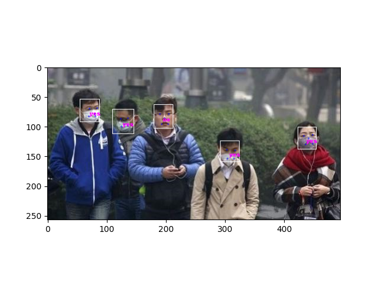

# 口罩佩戴检测  

3210104591 秦雨扬

## 实验背景  

今年一场席卷全球的新型冠状病毒给人们带来了沉重的生命财产的损失。  
有效防御这种传染病毒的方法就是积极佩戴口罩。  
我国对此也采取了严肃的措施，在公共场合要求人们必须佩戴口罩。  
在本次实验中，我们要建立一个目标检测的模型，可以识别图中的人是否佩戴了口罩。

##  实验要求

1）建立深度学习模型，检测出图中的人是否佩戴了口罩，并将其尽可能调整到最佳状态。  
2）学习经典的模型 MTCNN 和 MobileNet 的结构。  
3）学习训练时的方法。  

## 实验思路

针对目标检测的任务，可以分为两个部分：目标识别和位置检测。  
通常情况下，特征提取需要由特有的特征提取神经网络来完成，如 VGG、MobileNet、ResNet 等，这些特征提取网络往往被称为 Backbone 。而在 BackBone 后面接全连接层(FC)就可以执行分类任务。  
但 FC 对目标的位置识别乏力。经过算法的发展，当前主要以特定的功能网络来代替 FC 的作用，如 Mask-Rcnn、SSD、YOLO 等。  
我们选择充分使用已有的人脸检测的模型，再训练一个识别口罩的模型，从而提高训练的开支、增强模型的准确率。

**常规目标检测：**  


**本次案例：**   


<div STYLE="page-break-after: always;"></div>

## MTCNN：人脸检测

参考文献：《Joint Face Detection and Alignment using Multi-task Cascaded Convolutional Networks》  
文献与代码地址：https://kpzhang93.github.io/MTCNN_face_detection_alignment/  

论文的主要贡献：  
1）**三阶段的级联（cascaded）架构**  
2）**coarse-to-fine 的方式**  
3）**new online hard sample mining 策略**  
4）**同时进行人脸检测和人脸对齐**  
5）**state-of-the-art 性能**  


## 口罩识别

在实验中，我们发现MTCNN的准确率较高，可能不用担心，只需要考虑其中的口罩识别。但是pytorch这边的mobilenet并没有实现。所以本实验的第一个内容是实现了MobileNet，我们这里采用了预训练的mobilenet_v2作为backbone,然后加了adaptive_avg_pool2d，再通过一个Dropout和Linear作为classifier。其中部分代码如下

```python
class MobileNet(nn.Module):
    def __init__(self, classes=2):
        super(MobileNet, self).__init__()
        self.mobilebone = torchvision.models.mobilenet_v2(pretrained=True).features
        # for param in self.mobilebone.parameters():
        #     param.requires_grad = False
        # self.avgpool = nn.AvgPool2d(kernel_size=7, stride=1)
        self.classifier = nn.Sequential(
            nn.Dropout(p=0.2),
            nn.Linear(1280, classes),
        )
        for m in self.modules():
            if isinstance(m, nn.Conv2d):
                n = m.kernel_size[0] * m.kernel_size[1] * m.out_channels
                m.weight.data.normal_(0, (2. / n) ** .5)
            if isinstance(m, nn.BatchNorm2d):
                m.weight.data.fill_(1)
                m.bias.data.zero_()

    def forward(self, x):
        x = self.mobilebone(x)
        x = nn.functional.adaptive_avg_pool2d(x, (1, 1))
        x = torch.flatten(x, 1)
        x = self.classifier(x)
        return x

```

之后由于torch部分代码约等于无，就中规中矩重新写了一个train函数，保存validation精度最高的模型，代码如下

```python
epochs = 200
model = MobileNet(classes=2).to(device)
optimizer = optim.Adam(model.parameters(), lr=0.1)  # 优化器
print('加载完成...')
# milestones=[10,50,100,250,500,750,1000]
# # 学习率下降的方式，acc三次不下降就下降学习率继续训练，衰减学习率
# scheduler =torch.optim.lr_scheduler.MultiStepLR(optimizer, milestones, gamma=0.5, last_epoch=-1, verbose=False)
milestones=[10,50,100,150]
# 学习率下降的方式，acc三次不下降就下降学习率继续训练，衰减学习率
scheduler =torch.optim.lr_scheduler.MultiStepLR(optimizer, milestones, gamma=0.3, last_epoch=-1, verbose=False)
# 损失函数
criterion = nn.CrossEntropyLoss()

best_loss = 1e9
best_acc=0
best_acc1=0
best_model_weights = copy.deepcopy(model.state_dict())
loss_list = []  # 存储损失函数值
acc_list=[]
for epoch in range(epochs):
    model.train()
    total_loss= 0
    total_acc=0
    total_num=0
    total_acc1=0
    total_num1=0
    for batch_idx, (x, y) in tqdm(enumerate(train_data_loader, 1)):
        x = x.to(device)
        y = y.to(device)
        pred_y = model(x)

        # print(pred_y.shape)
        # print(y.shape)

        loss = criterion(pred_y, y)
        pred_y = torch.max(pred_y, dim=1)[1]
        total_acc1+= (pred_y==y).sum()
        total_num1+=x.shape[0]
        optimizer.zero_grad()
        loss.backward()
        optimizer.step()
        total_loss+= loss.item()

    scheduler.step()
    print(optimizer.state_dict()['param_groups'][0]['lr'])
    model.eval()
    for batch_idx, (x, y) in tqdm(enumerate(valid_data_loader, 1)):
        x = x.to(device)
        y = y.to(device)
        with torch.no_grad():
            pred_y = model(x)
        # get the predicted labels of pred_y
        pred_y = torch.max(pred_y, dim=1)[1]
        total_acc+= (pred_y==y).sum()
        total_num+=x.shape[0]

    acc_list.append(total_acc/total_num)
    loss_list.append(loss.to("cpu").detach().numpy() )
    if total_acc > best_acc or (total_acc == best_acc and total_acc1>best_acc1):
        best_model_weights = copy.deepcopy(model.state_dict())
        best_acc = total_acc
    print('step:' + str(epoch + 1) + '/' + str(epochs) + ' || Total Loss: %.4f' % (total_loss/total_num1)+ ' || Train Acc: %.4f' % (total_acc1/total_num1)+' || Valid Acc: %.4f' % (total_acc/total_num))

    if(epoch%100==0):
        torch.save(best_model_weights, './results/temp.pth')
        # print('Finish Training.')
torch.save(best_model_weights, './results/temp.pth')
print('Finish Training.')
```

<div STYLE="page-break-after: always;"></div>

感觉一切都没有什么问题，但是我们进行训练正确率始终在70%左右，相当不理想。当时觉得是不是MobileNet哪里写错了，尝试了各种各样的classifer，但是效果一直不好。

尝试对数据集加入一些trick以增强鲁棒性，就采用了15度的随机旋转与随机裁剪并缩放，取消了原来的水平竖直翻转，但是效果仍然不佳。然后尝试疯狂调整lr等各种参数，但是效果均不行。然后我也尝试只调classifer和整个模型一起调，但是效果始终上不去，而且只调classifer精度甚至超不过50%。

然后我忽然想到，是不是数据集不够大，导致模型无法学到口罩的特征？一看正反例才300~400张图片，想想imagenet有14,197,122 images，COCO则更多，仿佛找到了原因。

于是找到了MFRD: Masked Face Recognition DataSet,其中有2203个正例与90,000张反例，我在反例中取了3000个，正例全部加入，形成了新的数据集。其中数据集扩充代码见add.py

再进行测试，第一个epoch 验证集精度就达到了90%,而200轮以后则达到了99%。

```
step:1/200 || Total Loss: 0.0233 || Train Acc: 0.8074 || Valid Acc: 0.9049
step:200/200 || Total Loss: 0.0000 || Train Acc: 0.9996 || Valid Acc: 0.9915
```

但是发现在实测中仍然识别精度很低。于是想是不是因为MTCNN识别的脸太小了，和数据集不一样。于是写了一个new_box函数对框进行一定的扩大，代码如下，但是无济于事

```python
    def new_box(self,box):
        print(box)
        x=np.array([box[0],box[1]])
        y=np.array([box[2],box[3]])
        middle=(x+y)/2
        err=(y-x)/2;
        err=err*1.1
        new_x=middle-err
        new_y=middle+err
        print([new_x[0],new_x[1],new_y[0],new_y[1],box[4:]])
        return [new_x[0],new_x[1],new_y[0],new_y[1],box[4:]]
```

再想想我精度都在90%以上，怎么可能在实际测试中都是错的呢？最后发现，mask_recognize中image.crop后没有resize!!!!!我真的会感谢课题组，呜呜呜。

修改了ask_recognize如下，精度直接指数上涨。

```python
    def mask_recognize(self, image):
        b_boxes, landmarks = self.detector.detect(image)
        detect_face_img = self.detector.draw_bboxes(image)
        face_num = len(b_boxes)
        mask_num = 0
        for box in b_boxes:
            box=self.new_box(box)
            face = image.crop(tuple(box[:4]))
            face=transforms.Resize((160, 160))(face)

            # input_tensor = transforms.ToTensor()(face).to(torch.device('cpu')).numpy()
            # in_arr = np.transpose(input_tensor, (1, 2, 0))  # 将(c,w,h)转换为(w,h,c)。但此时如果是全精度模型，转化出来的dtype=float64 范围是[0,1]。后续要转换为cv2对象，需要乘以255
            # cvimg = cv2.cvtColor(np.uint8(in_arr * 255), cv2.COLOR_RGB2BGR)
            # cv2.imshow("one",cvimg)
            # cv2.waitKey(0)

            # print(box)
            # face = np.array(face)
            face = transforms.ToTensor()(face).unsqueeze(0)
            self.mobilenet.eval()
            with torch.no_grad():
                predict_label = self.mobilenet(face).cpu().data.numpy()
            # print(predict_label)
            current_class = self.classes[np.argmax(predict_label).item()]
            draw = ImageDraw.Draw(detect_face_img)
            if current_class == "mask":
                mask_num += 1
                # font = ImageFont.truetype("consola.ttf", 5, encoding="unic"  )  # 设置字体
                draw.text(((box[0]+box[2])/2, (box[1]+box[3])/2), u'yes', 'fuchsia')
            else:
                # font = ImageFont.truetype("consola.ttf", 5, encoding="unic"  )  # 设置字体
                draw.text(((box[0]+box[2])/2, (box[1]+box[3])/2), u'no', 'fuchsia')

        return detect_face_img, face_num, mask_num
```

于是乎这个实验就完结撒花了，最终结果如下



<div STYLE="page-break-after: always;"></div>

## 源码

### train

```python
import warnings
# 忽视警告
warnings.filterwarnings('ignore')

import cv2
from PIL import Image
import numpy as np
import copy
import matplotlib.pyplot as plt
from tqdm.auto import tqdm
import torch
import torch.nn as nn
import torch.optim as optim
from torchvision.datasets import ImageFolder
import torchvision.transforms as T
from torch.utils.data import DataLoader

from torch_py.Utils import plot_image
from torch_py.MTCNN.detector import FaceDetector
from torch_py.MobileNet import MobileNet
from torch_py.FaceRec import Recognition

def processing_data(data_path, height=224, width=224, batch_size=32,
                    test_split=0.1):
    """
    数据处理部分
    :param data_path: 数据路径
    :param height:高度
    :param width: 宽度
    :param batch_size: 每次读取图片的数量
    :param test_split: 测试集划分比例
    :return:
    """
    transforms = T.Compose([
        # T.Resize((height, width)),
        T.RandomRotation(15,center=(height/2,width/2)),
        T.RandomResizedCrop((height, width),scale = (0.7,1.0)),
        # T.RandomHorizontalFlip(0.1),  # 进行随机水平翻转
        # T.RandomVerticalFlip(0.1),  # 进行随机竖直翻转
        T.ToTensor(),  # 转化为张量
        T.Normalize([0], [1]),  # 归一化
    ])

    dataset = ImageFolder(data_path, transform=transforms)
    # 划分数据集
    train_size = int((1-test_split)*len(dataset))
    test_size = len(dataset) - train_size
    train_dataset, test_dataset = torch.utils.data.random_split(dataset, [train_size, test_size])
    # 创建一个 DataLoader 对象
    train_data_loader = DataLoader(train_dataset, batch_size=batch_size,shuffle=True)
    valid_data_loader = DataLoader(test_dataset, batch_size=batch_size,shuffle=True)

    return train_data_loader, valid_data_loader


data_path = './datasets/5f680a696ec9b83bb0037081-momodel/data/image'
# train_data_loader, valid_data_loader = processing_data(data_path=data_path, height=160, width=160, batch_size=128)

pnet_path = "./torch_py/MTCNN/weights/pnet.npy"
rnet_path = "./torch_py/MTCNN/weights/rnet.npy"
onet_path = "./torch_py/MTCNN/weights/onet.npy"

torch.set_num_threads(1)
# 读取测试图片
img = Image.open("test.jpg")
# 加载模型进行识别口罩并绘制方框
recognize = Recognition()
draw = recognize.face_recognize(img)
plot_image(draw)

device = torch.device("cuda:0") if torch.cuda.is_available() else torch.device("cpu")
train_data_loader, valid_data_loader = processing_data(data_path=data_path, height=160, width=160, batch_size=64)
# for batch_idx, (x, y) in tqdm(enumerate(train_data_loader, 1)):
#     input_tensor = x[0].to(torch.device('cpu')).numpy()
#     in_arr = np.transpose(input_tensor, (1, 2, 0))  # 将(c,w,h)转换为(w,h,c)。但此时如果是全精度模型，转化出来的dtype=float64 范围是[0,1]。后续要转换为cv2对象，需要乘以255
#     cvimg = cv2.cvtColor(np.uint8(in_arr * 255), cv2.COLOR_RGB2BGR)
#     cv2.imshow("one",cvimg)
#     cv2.waitKey(0)
#     print(y)
#     # break
modify_x, modify_y = torch.ones((32, 3, 160, 160)), torch.ones((32))

epochs = 200
model = MobileNet(classes=2).to(device)
optimizer = optim.Adam(model.parameters(), lr=0.1)  # 优化器
print('加载完成...')
# milestones=[10,50,100,250,500,750,1000]
# # 学习率下降的方式，acc三次不下降就下降学习率继续训练，衰减学习率
# scheduler =torch.optim.lr_scheduler.MultiStepLR(optimizer, milestones, gamma=0.5, last_epoch=-1, verbose=False)
milestones=[10,50,100,150]
# 学习率下降的方式，acc三次不下降就下降学习率继续训练，衰减学习率
scheduler =torch.optim.lr_scheduler.MultiStepLR(optimizer, milestones, gamma=0.3, last_epoch=-1, verbose=False)
# 损失函数
criterion = nn.CrossEntropyLoss()

best_loss = 1e9
best_acc=0
best_acc1=0
best_model_weights = copy.deepcopy(model.state_dict())
loss_list = []  # 存储损失函数值
acc_list=[]
for epoch in range(epochs):
    model.train()
    total_loss= 0
    total_acc=0
    total_num=0
    total_acc1=0
    total_num1=0
    for batch_idx, (x, y) in tqdm(enumerate(train_data_loader, 1)):
        x = x.to(device)
        y = y.to(device)
        pred_y = model(x)

        # print(pred_y.shape)
        # print(y.shape)

        loss = criterion(pred_y, y)
        pred_y = torch.max(pred_y, dim=1)[1]
        total_acc1+= (pred_y==y).sum()
        total_num1+=x.shape[0]
        optimizer.zero_grad()
        loss.backward()
        optimizer.step()
        total_loss+= loss.item()

    scheduler.step()
    print(optimizer.state_dict()['param_groups'][0]['lr'])
    model.eval()
    for batch_idx, (x, y) in tqdm(enumerate(valid_data_loader, 1)):
        x = x.to(device)
        y = y.to(device)
        with torch.no_grad():
            pred_y = model(x)
        # get the predicted labels of pred_y
        pred_y = torch.max(pred_y, dim=1)[1]
        total_acc+= (pred_y==y).sum()
        total_num+=x.shape[0]

    acc_list.append(total_acc/total_num)
    loss_list.append(loss.to("cpu").detach().numpy() )
    if total_acc > best_acc or (total_acc == best_acc and total_acc1>best_acc1):
        best_model_weights = copy.deepcopy(model.state_dict())
        best_acc = total_acc
    print('step:' + str(epoch + 1) + '/' + str(epochs) + ' || Total Loss: %.4f' % (total_loss/total_num1)+ ' || Train Acc: %.4f' % (total_acc1/total_num1)+' || Valid Acc: %.4f' % (total_acc/total_num))

    if(epoch%100==0):
        torch.save(best_model_weights, './results/temp.pth')
        # print('Finish Training.')
torch.save(best_model_weights, './results/temp.pth')
print('Finish Training.')

plt.plot(loss_list,label = "loss")
plt.legend()
plt.show()

img = Image.open("test1.jpg")
detector = FaceDetector()
recognize = Recognition(model_path='results/temp.pth')
draw, all_num, mask_nums = recognize.mask_recognize(img)
plt.imshow(draw)
plt.show()
print("all_num:", all_num, "mask_num", mask_nums)
```

### test

```python
import warnings
# 忽视警告
warnings.filterwarnings('ignore')

import cv2
from PIL import Image
import numpy as np
import copy
import matplotlib.pyplot as plt
from tqdm.auto import tqdm
import torch
import torch.nn as nn
import torch.optim as optim
from torchvision.datasets import ImageFolder
import torchvision.transforms as T
from torch.utils.data import DataLoader

from torch_py.Utils import plot_image
from torch_py.MTCNN.detector import FaceDetector
from torch_py.MobileNet import MobileNet
from torch_py.FaceRec import Recognition

import torch
state_dict = torch.load('results/temp.pth', map_location="cpu")
torch.save(state_dict, 'results/old_temp.pth', _use_new_zipfile_serialization=False)

img = Image.open("test1.jpg")
detector = FaceDetector()
recognize = Recognition(model_path='results/temp.pth')
draw, all_num, mask_nums = recognize.mask_recognize(img)
plt.imshow(draw)
plt.show()
print("all_num:", all_num, "mask_num", mask_nums)
```

### FaceRec

```python
import torch
import numpy as np
import cv2

from PIL import Image
from PIL import Image, ImageDraw, ImageFont
from matplotlib import pyplot as plt  # 展示图片
from torchvision.transforms import transforms

try:
    from MTCNN.detector import FaceDetector
    from MobileNet import MobileNet
except:
    from .MTCNN.detector import FaceDetector
    from .MobileNet import MobileNet

def plot_image(image, image_title="", is_axis=False):
    """
    展示图像
    :param image: 展示的图像，一般是 np.array 类型
    :param image_title: 展示图像的名称
    :param is_axis: 是否需要关闭坐标轴，默认展示坐标轴
    :return:
    """
    # 展示图片
    plt.imshow(image)

    # 关闭坐标轴,默认关闭
    if not is_axis:
        plt.axis('off')

    # 展示受损图片的名称
    plt.title(image_title)

    # 展示图片
    plt.show()


class Recognition(object):
    classes = ["mask", "no_mask"]

    # def __init__(self, mobilenet_path="./results/test.pth"):
    def __init__(self, model_path=None):
        """
        :param: mobilenet_path: XXXX.pth
        """
        self.detector = FaceDetector()
        device = torch.device("cuda" if torch.cuda.is_available() else "cpu")
        self.mobilenet = MobileNet(classes=2)
        if model_path:
            self.mobilenet.load_state_dict(
                torch.load(model_path, map_location=device))

    def face_recognize(self, image):
        # 绘制并保存标注图
        drawn_image = self.detector.draw_bboxes(image)
        return drawn_image

    def new_box(self,box):
        print(box)
        x=np.array([box[0],box[1]])
        y=np.array([box[2],box[3]])
        middle=(x+y)/2
        err=(y-x)/2;
        err=err*1.1
        new_x=middle-err
        new_y=middle+err
        print([new_x[0],new_x[1],new_y[0],new_y[1],box[4:]])
        return [new_x[0],new_x[1],new_y[0],new_y[1],box[4:]]
    def mask_recognize(self, image):
        b_boxes, landmarks = self.detector.detect(image)
        detect_face_img = self.detector.draw_bboxes(image)
        face_num = len(b_boxes)
        mask_num = 0
        for box in b_boxes:
            box=self.new_box(box)
            face = image.crop(tuple(box[:4]))
            face=transforms.Resize((160, 160))(face)

            # input_tensor = transforms.ToTensor()(face).to(torch.device('cpu')).numpy()
            # in_arr = np.transpose(input_tensor, (1, 2, 0))  # 将(c,w,h)转换为(w,h,c)。但此时如果是全精度模型，转化出来的dtype=float64 范围是[0,1]。后续要转换为cv2对象，需要乘以255
            # cvimg = cv2.cvtColor(np.uint8(in_arr * 255), cv2.COLOR_RGB2BGR)
            # cv2.imshow("one",cvimg)
            # cv2.waitKey(0)

            # print(box)
            # face = np.array(face)
            face = transforms.ToTensor()(face).unsqueeze(0)
            self.mobilenet.eval()
            with torch.no_grad():
                predict_label = self.mobilenet(face).cpu().data.numpy()
            # print(predict_label)
            current_class = self.classes[np.argmax(predict_label).item()]
            draw = ImageDraw.Draw(detect_face_img)
            if current_class == "mask":
                mask_num += 1
                # font = ImageFont.truetype("consola.ttf", 5, encoding="unic"  )  # 设置字体
                draw.text(((box[0]+box[2])/2, (box[1]+box[3])/2), u'yes', 'fuchsia')
            else:
                # font = ImageFont.truetype("consola.ttf", 5, encoding="unic"  )  # 设置字体
                draw.text(((box[0]+box[2])/2, (box[1]+box[3])/2), u'no', 'fuchsia')

        return detect_face_img, face_num, mask_num


"""
检测人脸，返回人脸位置坐标
其中b_boxes是一个n*5的列表、landmarks是一个n*10的列表，n表示检测出来的人脸个数，数据详细情况如下：
bbox：[左上角x坐标, 左上角y坐标, 右下角x坐标, 右下角y坐标, 检测评分]
landmark：[右眼x, 左眼x, 鼻子x, 右嘴角x, 左嘴角x, 右眼y, 左眼y, 鼻子y, 右嘴角y, 左嘴角y]
"""
if __name__ == "__main__":
    torch.set_num_threads(1)
    detector = FaceDetector()
    img = Image.open("./test1.jpg")
    recognize = Recognition()

    """---detect face--"""
    # draw = recognize.face_recognize(img)
    # plot_image(draw)

    """---crop face ---"""
    draw, all_num, mask_nums = recognize.mask_recognize(img)
    plot_image(draw)
    print("all_num:", all_num, "mask_num", mask_nums)

```

### MobileNet

```python
import torch
import torch.nn as nn
import torchvision
import torch.nn.functional as F


# class MobileNet(nn.Module):
#     def __init__(self, classes=2):
#         super(MobileNet, self).__init__()
#         lastconv_output_channels=960
#         last_channel=50
#         self.mobilebone = torchvision.models.mobilenet_v3_large(pretrained=True, width_mult=1.0,  reduced_tail=False, dilated=False).features
#         for param in self.mobilebone.parameters():
#             # print(param)
#             param.requires_grad = False
#         self.avgpool = nn.AdaptiveAvgPool2d(1)
#         self.classifier = nn.Sequential(
#             nn.Linear(lastconv_output_channels, last_channel),
#             # nn.ReLU(),
#             # nn.Hardswish(inplace=True),
#             # nn.Dropout(p=0.2, inplace=True),
#             nn.Linear(last_channel, classes),
#         )
#
#         for m in self.modules():
#             if isinstance(m, nn.Conv2d):
#                 nn.init.kaiming_normal_(m.weight, mode="fan_out")
#                 if m.bias is not None:
#                     nn.init.zeros_(m.bias)
#             elif isinstance(m, (nn.BatchNorm2d, nn.GroupNorm)):
#                 nn.init.ones_(m.weight)
#                 nn.init.zeros_(m.bias)
#             elif isinstance(m, nn.Linear):
#                 nn.init.normal_(m.weight, 0, 0.01)
#                 nn.init.zeros_(m.bias)
#
#     def forward(self, x):
#         x = self.mobilebone(x)
#         # print(x.shape)
#         x = self.avgpool(x)
#         x = torch.flatten(x, 1)
#
#         x = self.classifier(x)
#         return x
#
#     def _top_conv(self, in_channel, out_channel, blocks):
#         layers = []
#         for i in range(blocks):
#             layers.append(self._conv_dw(in_channel, out_channel, 1))
#         return nn.Sequential(*layers)
#
#     def _conv_bn(self, in_channel, out_channel, stride):
#         return nn.Sequential(
#             nn.Conv2d(in_channel, out_channel, 3, stride, padding=1, bias=False),
#             nn.BatchNorm2d(out_channel),
#             nn.ReLU(inplace=True),
#         )
#
#     def _conv_dw(self, in_channel, out_channel, stride):
#         return nn.Sequential(
#             #nn.Conv2d(in_channel, in_channel, 3, stride, 1, groups=in_channel, bias=False),
#             #nn.BatchNorm2d(in_channel),
#             #nn.ReLU(inplace=True),
#             nn.Conv2d(in_channel, out_channel, 1, 1, 0, bias=False),
#             nn.BatchNorm2d(out_channel),
#             nn.ReLU(inplace=False),
#         )


class MobileNet(nn.Module):
    def __init__(self, classes=2):
        super(MobileNet, self).__init__()
        self.mobilebone = torchvision.models.mobilenet_v2(pretrained=True).features
        # for param in self.mobilebone.parameters():
        #     param.requires_grad = False
        # self.avgpool = nn.AvgPool2d(kernel_size=7, stride=1)
        self.classifier = nn.Sequential(
            nn.Dropout(p=0.2),
            nn.Linear(1280, classes),
        )
        for m in self.modules():
            if isinstance(m, nn.Conv2d):
                n = m.kernel_size[0] * m.kernel_size[1] * m.out_channels
                m.weight.data.normal_(0, (2. / n) ** .5)
            if isinstance(m, nn.BatchNorm2d):
                m.weight.data.fill_(1)
                m.bias.data.zero_()

    def forward(self, x):
        x = self.mobilebone(x)
        x = nn.functional.adaptive_avg_pool2d(x, (1, 1))
        x = torch.flatten(x, 1)
        x = self.classifier(x)
        return x

    def _top_conv(self, in_channel, out_channel, blocks):
        layers = []
        for i in range(blocks):
            layers.append(self._conv_dw(in_channel, out_channel, 1))
        return nn.Sequential(*layers)

    def _conv_bn(self, in_channel, out_channel, stride):
        return nn.Sequential(
            nn.Conv2d(in_channel, out_channel, 3, stride, padding=1, bias=False),
            nn.BatchNorm2d(out_channel),
            nn.ReLU(inplace=True),
        )

    def _conv_dw(self, in_channel, out_channel, stride):
        return nn.Sequential(
            #nn.Conv2d(in_channel, in_channel, 3, stride, 1, groups=in_channel, bias=False),
            #nn.BatchNorm2d(in_channel),
            #nn.ReLU(inplace=True),
            nn.Conv2d(in_channel, out_channel, 1, 1, 0, bias=False),
            nn.BatchNorm2d(out_channel),
            nn.ReLU(inplace=False),
        )

if __name__ == "__main__":
    import numpy as np

    x = np.zeros((3, 160, 160))
    x = torch.from_numpy(x).float().unsqueeze(0)
    print(x.shape)
    con_block = MobileNet(2)
    prob = con_block(x)
    print(prob.shape)

```

### add

```python
data_path = './datasets/5f680a696ec9b83bb0037081-momodel/data/image'
path="MFRD/AFDB_face_dataset"

import os
import glob
import random
import cv2

Image_name_list=[]
# data_dir = 'dataset/'  # 文件地址/名称
classes = os.listdir(path)
for cls in classes:
    # print(cls)
    Image_glob = os.path.join(path+"/"+cls, "*.png")
    Image_name_list.extend(glob.glob(Image_glob))
    Image_glob = os.path.join(path+"/"+cls, "*.jpg")
    Image_name_list.extend(glob.glob(Image_glob))

print(len(Image_name_list))
random.shuffle(Image_name_list)
index=0
for file in Image_name_list:
    img = cv2.imread(file)
    # print(img.shape)
    # print(img)
    index+=1
    if(index>3000):
        break
    # img = cv2.resize(img, (160, 160))
    # print("/datasets/5f680a696ec9b83bb0037081-momodel/data/image/mask/"+str(index)+".jpg")
    cv2.imwrite("datasets/5f680a696ec9b83bb0037081-momodel/data/image/nomask/"+str(index)+".jpg", img)
    # break
    print(index)

```

